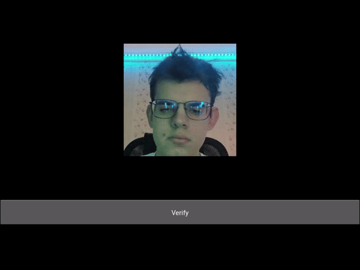

# Siamense Neural Network App
This project implements a Siamese neural network architecture as described in [this paper](https://www.cs.cmu.edu/~rsalakhu/papers/oneshot1.pdf). The network takes two images as input and outputs a binary classification (1 or 0) indicating whether the images are similar or not.

In this project, the neural network is used to create an application similar to FaceID (the neural network determines whether the person in the webcam image is you or another person).
## Project structure
- `app` 
  - `app.py` - сreating an application with a GUI 
- `collect_data` 
  - `data_collection.ipynb` - downloading a dataset and moving the data to other folders
  - `webcam_data_collection.ipynb` - gathering data from a webcam
- `model`
  - `SNN.py` - PyTorch implementation of a Siamese neural network
- `scripts`
  - `constants.py` - project constants(folder paths, epochs, etc.)
  - `utils.py` - various utility functions
  - `train_utils.py` - utility functions for model training
  - `make_folders.py` - creating folders with the necessary structure
- `Dataset.py` - dataset for model training
- `model_demo.ipynb` - simple example of model execution (works only with trained model and data
- `train.py` - model training

## Dataset
[Labeled Faces in the Wild Home Dataset](http://vis-www.cs.umass.edu/lfw/index.html) is used for training the neural network(negative samples)

[Download link](http://vis-www.cs.umass.edu/lfw/lfw.tgz)

## Setup and Usage Guide
1. Run `scripts/make_folders.py` to create the required folder structure.
  - The training data has the following structure:
    - `Anchor`: reference images compared to other images
    - `Positive`: images for which the `anchor` image is considered similar (label 1)
    - `Negative`: images for which the `anchor` image is not considered similar (label 0)
    In the `anchor` and `positive` folders, there will be images of your face captured from the webcam.
    In the `negative` folder, all data from the lfw dataset (images of other people) will be placed.
2. Execute `collect_data/data_collection.ipynb` to gather data from the dataset and organize it in the required folders.
3. Utilize `collect_data/webcam_data_collection.ipynb` to collect data from your webcam.
4. Train the model on your data by running `train.py`.
5. See a simple demonstration of the model's functionality by running `model_demo.ipynb`.
6. Launch the application by running `app/app.py`.
   
## App Demo

